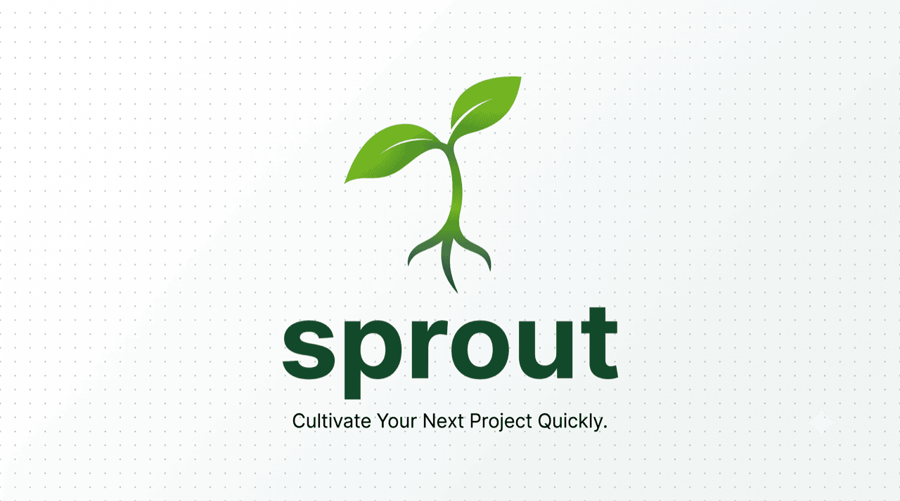

<p align="center">
  
</p>

<p align="center">
  <b>🌱 sprout</b> — start a project in seconds with your stack, your skills and your
  agent context already wired.<br>
  POSIX <code>sh</code> · interactive wizard · <code>--dry-run</code> · zero runtime deps.
</p>

<p align="center">
  <a href="LICENSE"></a>
  
  
</p>

<p align="center">
  <a href="https://github.com/jairyara/sprout/releases"></a>
  <a href="https://github.com/jairyara/sprout/stargazers"></a>
  <a href="https://github.com/jairyara/sprout/commits"></a>
  <a href="https://github.com/jairyara/sprout/issues"></a>
  <a href="https://github.com/jairyara/sprout/graphs/contributors"></a>
</p>

<p align="center">
  <a href="#-english">English</a> · <a href="#-español">Español</a>
</p>

---

## 🌱 English

### What is sprout?

`sprout` scaffolds a new project and leaves it **ready to build with an AI agent**: the
official scaffolder runs first (e.g. `create-astro`, `laravel new`), then sprout layers its
own **overlay**, downloads the **Agent Skills** for that project type, and wires the
multi-agent context (`AGENTS.md` + symlinks for Claude/Gemini/Codex/Copilot).

It works in **two planes**:

| Plane | What | Where it lives |
|---|---|---|
| **1 · CLIs** | Global terminal tools (`rg`, `fd`, `fzf`, `gh`, …) | Installed on your machine via `brew`/`pacman`. **Never** vendored into the repo. |
| **2 · Skills** | Agent Skills (`SKILL.md` folders) | Downloaded on-demand and **vendored** into each generated project, pinned in `skills.lock`. |

---

### Requirements

sprout itself only needs a **POSIX shell** (`sh`) and `git`. Everything else is optional and
either installed for you (assisted) or by you (manual).

| Need | Why | Notes |
|---|---|---|
| `sh` + `git` | run sprout, init repos | Pre-installed on macOS/Linux. |
| `brew` (macOS/Linux) **or** `pacman` (Arch) | assisted CLI install | Without one, install the core CLIs manually (see below). |
| Node + a JS package manager | web/JS scaffolders | `pnpm` (default) / `npm` / `yarn` / `bun`. sprout can provision via Corepack. |

---

### Installation

There are two ways. The **assisted** installer is recommended; the **manual** route is fully
documented so you never get stuck.

#### Option A — Assisted (recommended)

```sh
git clone https://github.com/jairyara/sprout.git ~/.sprout
cd ~/.sprout
./install.sh
```

The assisted installer does **all** of this explicitly and tells you each step:

1. **Links the `sprout` command into your PATH.** It symlinks `sprout` into `~/.local/bin`
   (created if missing).
2. **Adds that directory to your shell rc so the command works in every new terminal.**
   sprout detects your shell and appends the right line **only if it isn't already there**:

   | Shell | File edited | Line appended |
   |---|---|---|
   | `zsh` | `~/.zshrc` | `export PATH="$HOME/.local/bin:$PATH"` |
   | `bash` | `~/.bashrc` (and `~/.bash_profile` on macOS) | `export PATH="$HOME/.local/bin:$PATH"` |
   | `fish` | `~/.config/fish/config.fish` | `fish_add_path "$HOME/.local/bin"` |

   > The edit is **idempotent** (run the installer twice, it won't duplicate the line) and is
   > marked with a `# >>> sprout >>>` … `# <<< sprout <<<` block so it's easy to find or remove.

3. **Installs the core CLIs** (Plane 1) via `brew` or `pacman` — only the ones you're missing.
   Already-present tools are left untouched.
4. **Verifies the result.** It prints whether each command resolves, so you know immediately
   if a PATH change still needs a shell reload.

After it finishes, **open a new terminal** (or reload your shell) and verify:

```sh
exec "$SHELL" -l        # or just open a new terminal tab
sprout --version
sprout doctor           # checks scaffolders + core CLIs are reachable
```

> **Why the rc edit matters:** installing a binary into `~/.local/bin` does nothing if that
> directory isn't on your `PATH`. The assisted installer guarantees the path is persisted in
> your shell rc so you never hit a "command not found: sprout" after restarting the terminal.

#### Option B — Manual (no installer, or no `brew`/`pacman`)

**1. Get the code and make `sprout` reachable.**

```sh
git clone https://github.com/jairyara/sprout.git ~/.sprout

# Put the command on your PATH. Pick the line for YOUR shell and add it to its rc file,
# then reload the shell.

# zsh  →  ~/.zshrc
echo 'export PATH="$HOME/.local/bin:$PATH"' >> ~/.zshrc
ln -s ~/.sprout/sprout ~/.local/bin/sprout
source ~/.zshrc

# bash →  ~/.bashrc   (on macOS also ~/.bash_profile)
echo 'export PATH="$HOME/.local/bin:$PATH"' >> ~/.bashrc
ln -s ~/.sprout/sprout ~/.local/bin/sprout
source ~/.bashrc

# fish →  ~/.config/fish/config.fish
fish_add_path "$HOME/.local/bin"
ln -s ~/.sprout/sprout ~/.local/bin/sprout
```

> `mkdir -p ~/.local/bin` first if the folder doesn't exist.

**2. Install the core CLIs yourself (Plane 1).** These are global tools, not project deps:

| Tool | What it's for | macOS / Linux (`brew`) | Arch (`pacman`) |
|---|---|---|---|
| `rg` | fast code/text search | `brew install ripgrep` | `pacman -S ripgrep` |
| `fd` | friendly `find` | `brew install fd` | `pacman -S fd` |
| `fzf` | fuzzy picker | `brew install fzf` | `pacman -S fzf` |
| `bat` | `cat` with colors | `brew install bat` | `pacman -S bat` |
| `jq` | JSON on the CLI | `brew install jq` | `pacman -S jq` |
| `yq` | YAML on the CLI | `brew install yq` | `pacman -S yq` |
| `gh` | GitHub from terminal | `brew install gh` | `pacman -S github-cli` |
| `delta` | readable `git diff` | `brew install git-delta` | `pacman -S git-delta` |
| `lazygit` | terminal git UI | `brew install lazygit` | `pacman -S lazygit` |
| `just` | task runner | `brew install just` | `pacman -S just` |
| `gitleaks` | scan for leaked secrets | `brew install gitleaks` | `pacman -S gitleaks` |

> No `brew`/`pacman`? Each tool above links to a release binary on its project page — download
> it, put it on your `PATH`, done. sprout never *requires* these to scaffold; `sprout doctor`
> just warns about the missing ones.

**3. Verify.**

```sh
sprout --version
sprout doctor
```

---

### Quick start

```sh
sprout                       # interactive wizard (default)
sprout web my-site           # non-interactive: an Astro + Tailwind site
sprout --dry-run web demo    # show every step, change nothing
```

### Commands

```sh
sprout                                   interactive wizard
sprout <type> <name> [options]           non-interactive scaffold
sprout list                              list types, stacks, skills, CLIs
sprout doctor                            verify scaffolders + core CLIs are present
sprout skills add <name[@ref]> [dir]     download & vendor one more skill into a project
sprout skills update [name] [dir]        re-resolve to latest, refresh lock + auto-invoke table
sprout -h | --help                       full help
sprout --version
```

**Common options** (see `sprout --help` for all):

```sh
--stack <name>          stack variant (e.g. fullstack: laravel|django|fastapi)
--skills "a,b@1.2.0"    override the skill set; pin a skill with name@ref
--agent "claude gemini" agent context to wire (default: claude)
--install-clis          install ALL missing global CLIs (default: only warn)
--dry-run               print what would happen, do nothing
```

### Project types

| Type | Default | Variants (`--stack`) |
|---|---|---|
| `web` | Astro + Tailwind | — |
| `fullstack` | Laravel | django · fastapi |
| `desktop` | Tauri | wails · fyne · egui |
| `mobile` | React Native | flutter · kotlin · swift |
| `ext` | Chromium MV3 | wxt |

### What a generated project looks like

```
my-site/
├── src/ …                       ← from the official scaffolder
├── astro.config.mjs             ← sprout overlay (tailwind already wired)
├── AGENTS.md                    ← single source of truth + auto-invoke table
├── CLAUDE.md → AGENTS.md        ← symlinks per agent (gitignored)
├── GEMINI.md → AGENTS.md
├── .claude/skills/ → ../skills  ← skills linked per agent
├── skills/                      ← skills for this type, downloaded & vendored here
│   ├── frontend-design/SKILL.md
│   └── systematic-debugging/SKILL.md
├── skills.lock                  ← exact source@ref + SHA per skill (reproducible)
└── .gitignore                   ← symlink entries merged in
```

### Uninstall

```sh
rm ~/.local/bin/sprout            # remove the command
rm -rf ~/.sprout                  # remove the clone
# then delete the  # >>> sprout >>> … # <<< sprout <<<  block from your shell rc
```

---

## 🌱 Español

<p align="center">
  
</p>

### ¿Qué es sprout?

`sprout` genera un proyecto nuevo y lo deja **listo para construir con un agente de IA**:
primero corre el scaffolder oficial (p. ej. `create-astro`, `laravel new`), luego sprout
añade su propio **overlay**, descarga las **Agent Skills** del tipo de proyecto y cablea el
contexto multi-agente (`AGENTS.md` + symlinks para Claude/Gemini/Codex/Copilot).

Funciona en **dos planos**:

| Plano | Qué | Dónde vive |
|---|---|---|
| **1 · CLIs** | Herramientas globales de terminal (`rg`, `fd`, `fzf`, `gh`, …) | Se instalan en tu máquina vía `brew`/`pacman`. **Nunca** se copian al repo. |
| **2 · Skills** | Agent Skills (carpetas `SKILL.md`) | Se descargan on-demand y se **vendorizan** en cada proyecto, fijadas en `skills.lock`. |

---

### Requisitos

sprout solo necesita un **shell POSIX** (`sh`) y `git`. Lo demás es opcional y se instala por
ti (asistido) o por ti mismo (manual).

| Necesitas | Para qué | Notas |
|---|---|---|
| `sh` + `git` | correr sprout, iniciar repos | Ya vienen en macOS/Linux. |
| `brew` (macOS/Linux) **o** `pacman` (Arch) | instalación asistida de CLIs | Sin alguno, instala las CLIs core a mano (más abajo). |
| Node + gestor JS | scaffolders web/JS | `pnpm` (def.) / `npm` / `yarn` / `bun`. sprout puede aprovisionarlo con Corepack. |

---

### Instalación

Hay dos vías. La **asistida** es la recomendada; la **manual** está documentada por completo
para que nunca te quedes atascado.

#### Opción A — Asistida (recomendada)

```sh
git clone https://github.com/jairyara/sprout.git ~/.sprout
cd ~/.sprout
./install.sh
```

El instalador asistido hace **todo** esto de forma explícita y te avisa de cada paso:

1. **Enlaza el comando `sprout` en tu PATH.** Crea un symlink de `sprout` en `~/.local/bin`
   (lo crea si no existe).
2. **Agrega ese directorio al rc de tu shell para que el comando funcione en cada terminal
   nueva.** sprout detecta tu shell y añade la línea correcta **solo si no está ya presente**:

   | Shell | Archivo editado | Línea agregada |
   |---|---|---|
   | `zsh` | `~/.zshrc` | `export PATH="$HOME/.local/bin:$PATH"` |
   | `bash` | `~/.bashrc` (y `~/.bash_profile` en macOS) | `export PATH="$HOME/.local/bin:$PATH"` |
   | `fish` | `~/.config/fish/config.fish` | `fish_add_path "$HOME/.local/bin"` |

   > La edición es **idempotente** (córrelo dos veces y no duplica la línea) y queda marcada
   > con un bloque `# >>> sprout >>>` … `# <<< sprout <<<` para hallarla o quitarla fácil.

3. **Instala las CLIs core** (Plano 1) vía `brew` o `pacman` — solo las que te falten. Las que
   ya tienes no se tocan.
4. **Verifica el resultado.** Imprime si cada comando resuelve, así sabes al instante si un
   cambio de PATH todavía requiere recargar el shell.

Al terminar, **abre una terminal nueva** (o recarga tu shell) y verifica:

```sh
exec "$SHELL" -l        # o simplemente abre una pestaña nueva
sprout --version
sprout doctor           # chequea que scaffolders + CLIs core sean alcanzables
```

> **Por qué importa editar el rc:** instalar un binario en `~/.local/bin` no sirve de nada si
> ese directorio no está en tu `PATH`. El instalador asistido garantiza que la ruta quede
> persistida en el rc de tu shell, para que nunca te aparezca un "command not found: sprout"
> al reiniciar la terminal.

#### Opción B — Manual (sin instalador, o sin `brew`/`pacman`)

**1. Obtén el código y haz `sprout` alcanzable.**

```sh
git clone https://github.com/jairyara/sprout.git ~/.sprout

# Pon el comando en tu PATH. Elige la línea de TU shell y agrégala a su rc,
# luego recarga el shell.

# zsh  →  ~/.zshrc
echo 'export PATH="$HOME/.local/bin:$PATH"' >> ~/.zshrc
ln -s ~/.sprout/sprout ~/.local/bin/sprout
source ~/.zshrc

# bash →  ~/.bashrc   (en macOS también ~/.bash_profile)
echo 'export PATH="$HOME/.local/bin:$PATH"' >> ~/.bashrc
ln -s ~/.sprout/sprout ~/.local/bin/sprout
source ~/.bashrc

# fish →  ~/.config/fish/config.fish
fish_add_path "$HOME/.local/bin"
ln -s ~/.sprout/sprout ~/.local/bin/sprout
```

> Ejecuta `mkdir -p ~/.local/bin` primero si la carpeta no existe.

**2. Instala las CLIs core tú mismo (Plano 1).** Son herramientas globales, no dependencias
del proyecto:

| Herramienta | Para qué sirve | macOS / Linux (`brew`) | Arch (`pacman`) |
|---|---|---|---|
| `rg` | búsqueda de código/texto rápida | `brew install ripgrep` | `pacman -S ripgrep` |
| `fd` | `find` amigable | `brew install fd` | `pacman -S fd` |
| `fzf` | selector difuso | `brew install fzf` | `pacman -S fzf` |
| `bat` | `cat` con colores | `brew install bat` | `pacman -S bat` |
| `jq` | JSON en la terminal | `brew install jq` | `pacman -S jq` |
| `yq` | YAML en la terminal | `brew install yq` | `pacman -S yq` |
| `gh` | GitHub desde terminal | `brew install gh` | `pacman -S github-cli` |
| `delta` | `git diff` legible | `brew install git-delta` | `pacman -S git-delta` |
| `lazygit` | UI de git en terminal | `brew install lazygit` | `pacman -S lazygit` |
| `just` | runner de tareas | `brew install just` | `pacman -S just` |
| `gitleaks` | escanear secretos filtrados | `brew install gitleaks` | `pacman -S gitleaks` |

> ¿Sin `brew`/`pacman`? Cada herramienta tiene binarios de release en su página de proyecto —
> descárgalo, ponlo en tu `PATH` y listo. sprout nunca *exige* estas CLIs para generar; el
> comando `sprout doctor` solo avisa de las que falten.

**3. Verifica.**

```sh
sprout --version
sprout doctor
```

---

### Inicio rápido

```sh
sprout                       # asistente interactivo (por defecto)
sprout web mi-sitio          # no-interactivo: un sitio Astro + Tailwind
sprout --dry-run web demo    # muestra cada paso, no cambia nada
```

### Comandos

```sh
sprout                                   asistente interactivo
sprout <tipo> <nombre> [opciones]        scaffold no-interactivo
sprout list                              lista tipos, stacks, skills, CLIs
sprout doctor                            verifica scaffolders + CLIs core
sprout skills add <nombre[@ref]> [dir]   descarga y vendoriza otra skill en un proyecto
sprout skills update [nombre] [dir]      re-resuelve a latest, refresca lock + tabla auto-invoke
sprout -h | --help                       ayuda completa
sprout --version
```

**Opciones comunes** (todas en `sprout --help`):

```sh
--stack <nombre>        variante de stack (p. ej. fullstack: laravel|django|fastapi)
--skills "a,b@1.2.0"    sobrescribe el set de skills; fija una con nombre@ref
--agent "claude gemini" contexto de agente a cablear (def.: claude)
--install-clis          instala TODAS las CLIs globales faltantes (def.: solo avisa)
--dry-run               imprime qué haría, no ejecuta
```

### Tipos de proyecto

| Tipo | Por defecto | Variantes (`--stack`) |
|---|---|---|
| `web` | Astro + Tailwind | — |
| `fullstack` | Laravel | django · fastapi |
| `desktop` | Tauri | wails · fyne · egui |
| `mobile` | React Native | flutter · kotlin · swift |
| `ext` | Chromium MV3 | wxt |

### Cómo queda un proyecto generado

```
mi-sitio/
├── src/ …                       ← del scaffolder oficial
├── astro.config.mjs             ← overlay de sprout (tailwind ya cableado)
├── AGENTS.md                    ← fuente única + tabla auto-invoke
├── CLAUDE.md → AGENTS.md        ← symlinks por agente (gitignored)
├── GEMINI.md → AGENTS.md
├── .claude/skills/ → ../skills  ← skills enlazadas por agente
├── skills/                      ← skills de este tipo, descargadas y vendorizadas aquí
│   ├── frontend-design/SKILL.md
│   └── systematic-debugging/SKILL.md
├── skills.lock                  ← source@ref + SHA exacto por skill (reproducible)
└── .gitignore                   ← entradas de symlinks fusionadas
```

### Desinstalar

```sh
rm ~/.local/bin/sprout            # quita el comando
rm -rf ~/.sprout                  # quita el clon
# luego borra el bloque  # >>> sprout >>> … # <<< sprout <<<  de tu rc de shell
```

---

## Contributors · Colaboradores

Thanks to everyone who helps sprout grow 🌱 — *gracias a quienes ayudan a que sprout crezca.*

<p align="center">
  <a href="https://github.com/jairyara/sprout/graphs/contributors">
    
  </a>
</p>

---

<p align="center"><sub>🌱 sprout · POSIX sh · sibling of <code>divvy</code> in the dev-tools suite</sub></p>
